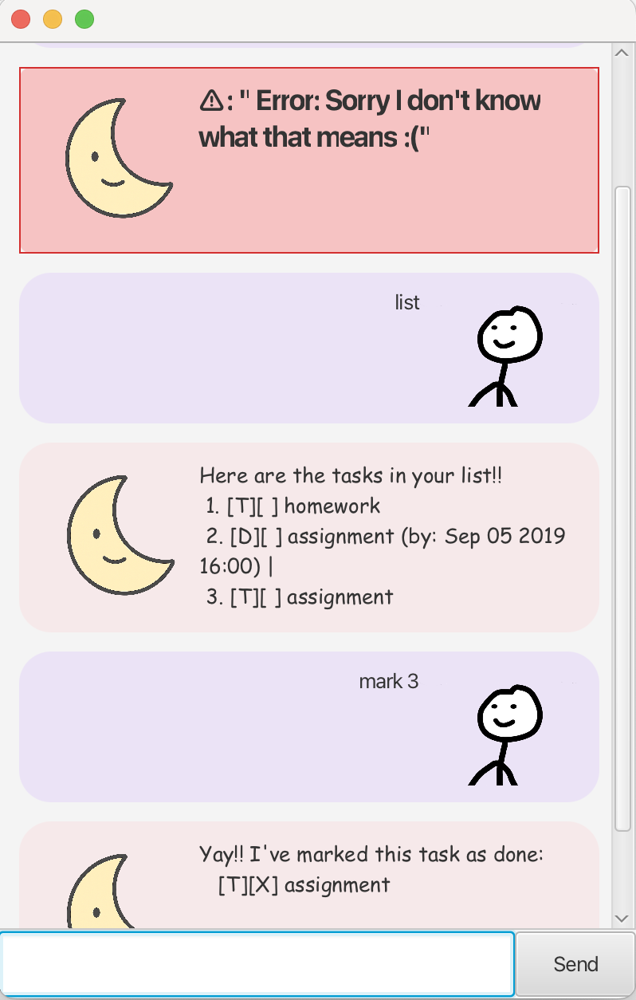

# Luna User Guide



## Features:
1. [Adding Todos](#Adding-todos)
2. [Adding Deadlines](#Adding-deadlines)
3. [Adding Events](#Adding-events)
4. [Listing tasks](#Listing-tasks)
5. [Mark / Unmark tasks](#Marking-and-unmarking-tasks)
6. [Delete tasks](#Deleting-tasks)
7. [Find tasks / tags](#Finding)
8. [Tagging](#Tagging)


### Adding Todos

Allows user to add tasks without specified time.

**Example:** `todo homework`

A task with the name "homework" will be added to the list. 

```
[T][] homework 
```

### Adding Deadlines

Allows user to add tasks with specified deadline.

**Example:** `deadline assignment `

A task with the name "homework" will be added to the list.

```
[T][] homework 
```